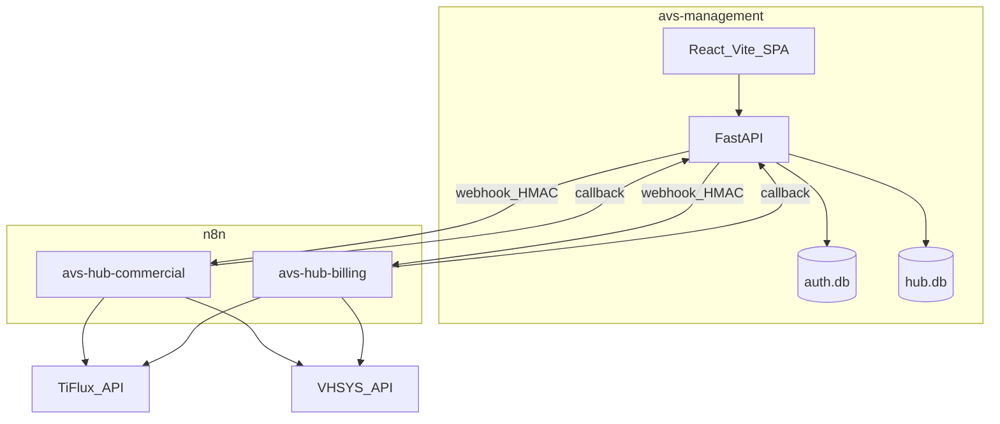

# Plano-guia: Hub Comercial + Faturamento no AVS Management

## Papel e estado

Este documento é o **plano de negócios + guia de produção** (Gerente). Artefatos de especificação já existem em [NFE/](file:///Users/jean.nascimento/Library/CloudStorage/OneDrive-AVSTecnologia®/NFE/) (`MODULO_ORCAMENTO_CONTRATO.md`, `PRE_REQUISITOS.md`, `sketch-fluxo-completo.html`, `ANALISE_PROJETO_AUTOMACAO.md`).

**Decisões fechadas:**
- Implementação **dentro** de [avs-management](file:///Users/jean.nascimento/Library/CloudStorage/OneDrive-AVSTecnologia®/Projetos/avs-management) (não na pasta NFE).
- Management = UI + SoT; n8n = execução; TiFlux/VHSYS = destinos.
- **2 fluxos n8n:** `avs-hub-commercial` e `avs-hub-billing` (timers só se necessário depois).
- Fila de faturamento no Management (API TiFlux sem pending/faturar).
- DB de domínio novo: SQLite `data/hub.db` (separado de `data/auth.db`).
- Entrega em fases: O1 (orçamento local) → O2 (n8n comercial) → F1 (faturamento) → O3 (contrato/follow-up).

**Ao iniciar execução:** criar [avs-management/.estado_atual.md](file:///Users/jean.nascimento/Library/CloudStorage/OneDrive-AVSTecnologia®/Projetos/avs-management/.estado_atual.md) com este plano e status das fases.

---

## Arquitetura alvo



**Stack existente a preservar:** FastAPI + orchestrator, React 19/Vite, session cookies + RBAC, `TifluxClient` / `VhsysClient` em [src/integrations/](file:///Users/jean.nascimento/Library/CloudStorage/OneDrive-AVSTecnologia®/Projetos/avs-management/src/integrations/).

---

## Organização de pastas (alvo)

```
avs-management/
  src/
    quotes/           # domain orçamento
      models.py       # SQL hub.db
      service.py
      schemas.py
    billing/          # domain faturamento
      models.py
      service.py
      schemas.py
    webhooks/         # saída n8n + verificação HMAC callback
    integrations/     # ESTENDER tiflux_client.py / vhsys_client.py
    auth/permissions.py  # novas permissões
    main.py           # rotas novas (padrão atual)
  frontend/src/
    pages/quotes/
    pages/billing/
    components/quotes/
    components/billing/
  docs/hub/           # copiar/linkar sketches NFE relevantes
  .estado_atual.md
```

NFE permanece como pasta de especificação/scripts de API; código de produto só no Management.

---

## Segurança e acesso

### Permissões novas ([permissions.py](file:///Users/jean.nascimento/Library/CloudStorage/OneDrive-AVSTecnologia®/Projetos/avs-management/src/auth/permissions.py))

| Key | Uso |
|-----|-----|
| `orcamentos` | Criar/editar/listar orçamentos |
| `aprovar_orcamento` | Marcar aprovado / disparar contrato |
| `gerar_contrato` | Push contrato TiFlux |
| `faturar` | Montar/editar fila de faturamento |
| `aprovar_fatura` | Gate humano → webhook billing |

Sincronizar: `PermissionKey` em `api/client.ts` + `useAuth.tsx`, `UsersManagePage`, Sidebar, App routes (`PermissionRoute`).

### Controles obrigatórios
- Tokens TiFlux/VHSYS **somente** server-side (`.env` / Settings); nunca no frontend.
- Webhooks n8n: header `X-AVS-Signature` (HMAC-SHA256 do body com `N8N_WEBHOOK_SECRET`).
- Callbacks n8n → Management: mesmo HMAC + IP allowlist se possível.
- `log_action` em approve/submit/emit (audit_logs já existe).
- Uploads PDF: tipo/tamanho max; path fora de web root; nomes UUID.
- Conta de serviço para tokens de API (não login pessoal).
- Dry-run flag `HUB_DRY_RUN=true` nos primeiros deploys (não chama POSTs externos).

### Sessão
Manter SessionMiddleware + CSRF atuais; novas rotas com `Depends(require_permission(...))`.

---

## Abordagem de UI

### Padrão visual
Seguir shell atual ([AppShell](file:///Users/jean.nascimento/Library/CloudStorage/OneDrive-AVSTecnologia®/Projetos/avs-management/frontend/src/components/layout/AppShell.tsx), Card, Button, WizardStepper como em Register/Inactivate):
- Nav: **Orçamentos**, **Faturamento** (ícones alinhados ao Sidebar).
- Dashboard: ActionCards condicionados às novas permissões.

### Telas Orçamento
1. **Lista** — filtros: status, temperatura lead, busca cliente.
2. **Editor** (wizard 3 passos):
   - Passo 1: Cliente (busca CNPJ/nome; modal overlay cadastro rápido reutilizando fluxo `/preview`+`/integrar` sem sair da tela).
   - Passo 2: Itens — seções **Implantação** e **Mensalidade**; templates; add/remove linhas; pagamento/desconto/3x; faturado por.
   - Passo 3: Revisão + ações: Salvar | Salvar e enviar (OS+ticket).
3. **Detalhe** — status timeline; botões Enviar ao cliente / Aprovar / Gerar contrato; preview PDF.

### Telas Faturamento
1. **Fila do mês** — clientes do dia; total; flags retenção/Pix.
2. **Detalhe run** — itens (contratos TiFlux GET); aprovar → dispara n8n.
3. **Exceção retenção** — input nº NF + valor líquido → `billing.nf_prefeitura`.
4. **Histórico** — status, IDs externos, links artefatos.

### UX crítica
- Autosave draft orçamento a cada mudança relevante.
- Modal cliente: trap focus; ao fechar, devolve `client_id` TiFlux/VHSYS sem limpar itens.
- Toasts de erro com `safe_error_message` (padrão backend).
- Estados vazios e loading com TanStack Query.

Sketch de referência: [NFE/sketch-fluxo-completo.html](file:///Users/jean.nascimento/Library/CloudStorage/OneDrive-AVSTecnologia®/NFE/sketch-fluxo-completo.html).

---

## Modelo de dados (`hub.db`)

**quotes:** id, client refs (local/tiflux/vhsys), cnpj, status (`draft|submitted|sent|approved|rejected|contracted`), lead_temperature, billed_by_*, payment plans, discounts, tiflux_ticket_number, vhsys_os_id, pdf_path, created_by, timestamps.

**quote_items:** quote_id, section (`implantacao|mensalidade`), name, qty, unit_value, total, template_key, sort_order.

**quote_templates:** key, name, section, lines_json.

**billing_runs:** id, client refs, competence, due_date, status (`draft|approved|awaiting_prefeitura|emitting|sent|error`), flags retencao/pix, totals, external ids, error_message, approved_by, timestamps.

**billing_items:** run_id, source (`contract|ticket`), external_ref, description, amount.

**billing_artifacts:** run_id, kind (`report|nf|boleto`), path_or_url.

**webhook_outbox:** id, event, payload_json, status, attempts, last_error (para retry confiável).

Migrations: script SQL versionado ou bootstrap em `hub_store.py` no startup (como AuthDatabase cria tabelas).

---

## Programação — backend

### Extensões de integração
- [tiflux_client.py](file:///Users/jean.nascimento/Library/CloudStorage/OneDrive-AVSTecnologia®/Projetos/avs-management/src/integrations/tiflux_client.py): `list_contracts`, `create_ticket`, `upload_ticket_file`, `post_client_answer`, `update_ticket_stage/status`, `create_contract` (validar endpoints antes do merge).
- [vhsys_client.py](file:///Users/jean.nascimento/Library/CloudStorage/OneDrive-AVSTecnologia®/Projetos/avs-management/src/integrations/vhsys_client.py): `create_ordem_servico`, `create_nota_servico`, `create_conta_receber`, download/link boleto (`/contas-receber` já validado em leitura).

### Rotas (em `main.py`, padrão atual)
| Método | Path | Permissão |
|--------|------|-----------|
| CRUD | `/orcamentos`, `/orcamentos/{id}` | `orcamentos` |
| POST | `/orcamentos/{id}/submit` | `orcamentos` |
| POST | `/orcamentos/{id}/mark-sent` | `orcamentos` |
| POST | `/orcamentos/{id}/approve` | `aprovar_orcamento` |
| POST | `/orcamentos/{id}/gerar-contrato` | `gerar_contrato` |
| GET/POST | `/faturamento/runs` | `faturar` |
| POST | `/faturamento/runs/{id}/approve` | `aprovar_fatura` |
| POST | `/faturamento/runs/{id}/prefeitura` | `aprovar_fatura` |
| POST | `/webhooks/n8n/callback` | HMAC (sem session user) |

Submit/approve: gravam outbox + HTTP ao n8n; resposta 202 se assíncrono.

### Config (`.env`)
`N8N_COMMERCIAL_WEBHOOK_URL`, `N8N_BILLING_WEBHOOK_URL`, `N8N_WEBHOOK_SECRET`, `HUB_DB_PATH`, `HUB_DRY_RUN`, `TIFLUX_DESK_COMERCIAL_ID=36089` (já observado), IDs de status/prioridade/estágio quando mapeados.

---

## Programação — n8n (2 fluxos)

### `avs-hub-commercial`
Webhook → Verify HMAC → Switch(`event`):
- `quote.submit` → VHSYS OS → TiFlux ticket → anexo PDF/HTML → callback
- `quote.sent` → update stage/status → callback
- `quote.approved` → create contracts from items → callback

### `avs-hub-billing`
Webhook → Verify HMAC → Switch:
- `billing.approved` → branch retenção → VHSYS NF+CR+boleto → TiFlux ticket cobrança (3 anexos) → callback
- `billing.nf_prefeitura` → CR líquido + boleto → ticket → callback

Error workflow: callback `status=error` + notificação Teams/e-mail.

---

## Fases de construção (ordem cirúrgica)

Cada fase = um especialista por vez (evitar misturar FE+BE+n8n na mesma entrega).

| Fase | Escopo | Especialista |
|------|--------|----------------|
| **P0** | `.estado_atual.md`, permissões, `hub.db` schema, Settings | Backend Python |
| **O1** | CRUD orçamento + UI lista/editor + modal cliente + PDF local | Backend → depois Frontend |
| **O2** | Extensões TiFlux/VHSYS + webhook commercial + fluxo n8n 1 | Backend → n8n |
| **F1** | billing_runs UI/API + fluxo n8n 2 + retenção | Backend → Frontend → n8n |
| **O3** | approve → gerar contrato; follow-up e-mail; temperatura/filtros | Backend/FE → n8n |
| **P1** | Testes pytest + e2e dry-run + docs em `docs/hub/` | QA / Docs |

Gate entre fases: dry-run com 1 cliente teste; sem POST fiscal real até F1 com `HUB_DRY_RUN=false` aprovado pelo financeiro.

---

## Critérios de aceite (guia)

- Orçamento salvo no Management sobrevive reload; modal cadastro não perde itens.
- Submit cria OS+ticket (ou dry-run log) e grava IDs externos.
- Aprovar orçamento gera contrato TiFlux com itens editáveis na UI antes do push.
- Fila faturamento: aprovar → NF/CR/boleto (ou fila prefeitura) → ticket com 3 anexos.
- Usuário sem permissão não vê nav nem acessa API (403).
- Segredos ausentes do bundle frontend.

---

## Riscos e mitigações

| Risco | Mitigação |
|-------|-----------|
| TiFlux sem create contract/stage API | Validar na O2; bloquear O3 até endpoint ou workaround UI |
| TiFlux sem pending billing | Já aceito: fila no Management |
| Retenção VHSYS NF | Branch humana prefeitura |
| OneDrive + secrets em NFE | Rotacionar tokens usados em testes; só `.env` no Management |

---

## Delegação (próximo passo)

Tech Lead desenha ADRs curtos (hub.db, HMAC, outbox) e fatia PRs por fase P0→O1→O2→F1→O3, atribuindo um especialista por PR (Python **ou** React **ou** n8n — nunca os três juntos).
