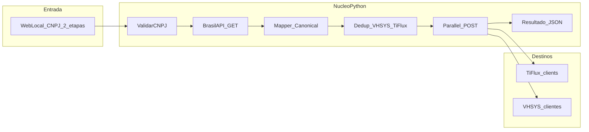

# Arquitetura — Integração CNPJ → TiFlux + VHSYS

## Objetivo

Automatizar o cadastro de clientes PJ: entrada de CNPJ → consulta BrasilAPI → revisão editável → seleção de mesas/grupos TiFlux → cadastro paralelo em TiFlux e VHSYS.

## Fluxo UI (2 etapas)

1. **CNPJ** → `POST /preview` (BrasilAPI + mesas/grupos TiFlux)
2. **Revisão** → usuário edita dados e marca mesas (`desk_ids`) e grupos (`technical_group_ids`)
3. **Confirmar** → `POST /integrar` (JSON) → cadastro TiFlux + VHSYS

## Fluxo



## Estrutura de pastas

```
src/
  main.py                 # FastAPI: GET /, POST /integrar
  config.py               # Variáveis de ambiente
  orchestrator.py         # Orquestração e dedup
  cnpj/
    validator.py          # Validação e formatação CNPJ
    brasilapi_client.py   # GET CNPJ na BrasilAPI
  mapping/
    canonical.py          # CompanyPayload + parse BrasilAPI
    tiflux_mapper.py
    vhsys_mapper.py
  integrations/
    tiflux_client.py
    vhsys_client.py
```

## APIs externas

| Sistema | Base | Auth |
|---------|------|------|
| BrasilAPI | `https://brasilapi.com.br/api/cnpj/v1/{cnpj}` | Nenhuma |
| TiFlux v2 | `https://api.tiflux.com/api/v2` | `Authorization: Bearer {token}` |
| VHSYS v2 | `https://api.vhsys.com/v2` | `access-token`, `secret-access-token`, `User-Agent` |

### TiFlux — criar cliente

- `POST /clients`
- Body mínimo: `name`, `social`, `social_revenue`, `status`
- **Obrigatório para visibilidade no painel:** `desk_ids` + `technical_group_ids` (copiados de `TIFLUX_REFERENCE_CLIENT_ID` ou `.env`)
- Sem mesas/grupos, a API retorna `id` mas o cliente fica invisível (falso positivo)
- Dedup: `GET /clients?social_revenue=` + paginação `offset/limit`
- Pós-criação: validar com `GET /clients/{id}` ou busca por CNPJ

### VHSYS — criar cliente

- `POST /clientes`
- Obrigatório na spec: `razao_cliente`
- Dedup: `GET /clientes?cnpj_cliente={formatado}`

## Modelo canônico (`CompanyPayload`)

| Campo | Origem BrasilAPI |
|-------|------------------|
| `cnpj_digits` | `cnpj` |
| `legal_name` | `razao_social` |
| `trade_name` | `nome_fantasia` ou fallback `razao_social` |
| `address.*` | `logradouro`, `numero`, etc. |
| `phone` | `ddd_telefone_1` |
| `email` | `email` |
| `status_active` | `descricao_situacao_cadastral == "ATIVA"` |

## Mapeamento → TiFlux

| Canônico | TiFlux |
|----------|--------|
| `trade_name` | `name` |
| `legal_name` | `social` |
| `cnpj_digits` | `social_revenue` |
| `status_active` | `status` (boolean) |

## Mapeamento → VHSYS

| Canônico | VHSYS |
|----------|-------|
| `legal_name` | `razao_cliente` |
| `trade_name` | `fantasia_cliente` |
| `cnpj_formatted` | `cnpj_cliente` |
| — | `tipo_pessoa: "PJ"`, `tipo_cadastro: "Cliente"` |
| endereço | `endereco_cliente`, `numero_cliente`, … |
| `phone` (máscara) | `fone_cliente` |
| `email` | `email_cliente` |
| `status_active` | `situacao_cliente`: Ativo/Inativo |

## Política de erros (v1)

1. CNPJ inválido → 400, sem chamadas externas.
2. Empresa não ATIVA → 422 com mensagem clara.
3. Cliente já existe em qualquer destino → 409 com detalhe de qual sistema.
4. Falha parcial (um POST ok, outro falha) → 207 com JSON `partial: true` e erros por sistema.
5. Sem rollback automático na v1.

## Variáveis de ambiente

Ver `.env.example`. Nunca versionar `.env`.

## Critérios de aceite

- [ ] `GET /` exibe formulário com campo CNPJ.
- [ ] `POST /integrar` com CNPJ válido consulta BrasilAPI e tenta cadastro nos dois sistemas.
- [ ] Dedup impede duplicata por CNPJ quando já cadastrado.
- [ ] Resposta JSON legível para sucesso, parcial e erro.

## Execução local

```bash
pip install -r requirements.txt
cp .env.example .env
# Preencher tokens
uvicorn src.main:app --reload --host 127.0.0.1 --port 8000
```

Abrir http://127.0.0.1:8000
