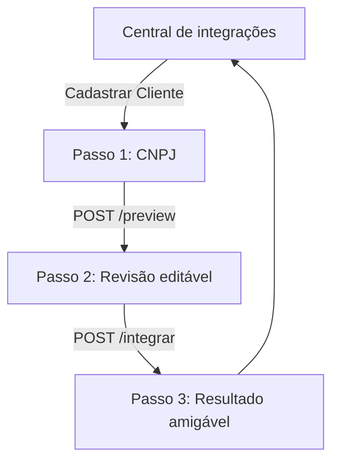
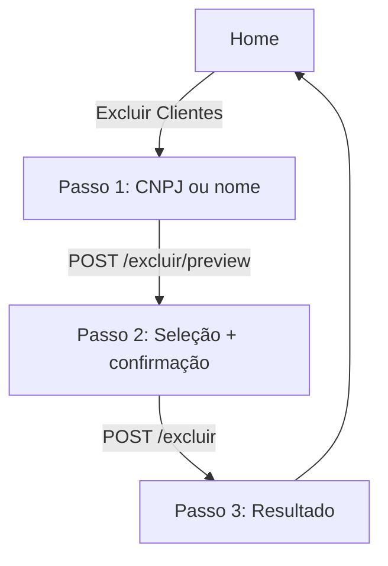
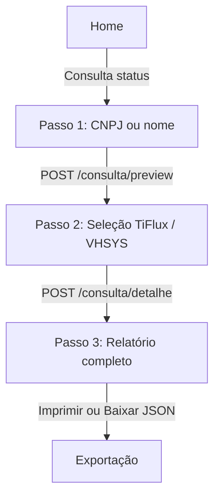

# Manual de operação e manutenção — AVS Management

Documento de referência para operação, manutenção e pontos de atenção do **AVS Management** (cadastro CNPJ → TiFlux + VHSYS).

## Visão geral

| Item | Descrição |
|------|-----------|
| **Propósito** | Cadastrar clientes PJ consultando CNPJ na BrasilAPI e replicando em TiFlux e VHSYS |
| **Interface** | Web local (`http://127.0.0.1:8000`) — tema AVS Tecnologia |
| **Stack** | Python 3.11+, FastAPI, httpx, `.env` |

## Fluxo da interface — Cadastrar



1. **Início** — menu com “Cadastrar Cliente”, “Excluir Clientes” e “Consulta status do cliente”.
2. **CNPJ** — consulta BrasilAPI + carrega mesas/grupos TiFlux. Erros exibidos em alerta vermelho na tela.
3. **Revisão** — dados editáveis + checkboxes de mesas (`desk_ids`) e grupos (`technical_group_ids`).
4. **Resultado** — mensagem de sucesso ou erro (não JSON bruto).

## Fluxo da interface — Excluir



1. **Busca** — informe CNPJ (14 dígitos válidos) ou nome (mín. 3 caracteres).
2. **Conferência** — lista clientes encontrados no TiFlux e VHSYS; selecione qual excluir em cada sistema (ou marque “Não excluir”).
3. **Confirmação** — checkbox obrigatório sobre irreversibilidade (TiFlux) e lixeira (VHSYS).
4. **Resultado** — sucesso, parcial ou erro por sistema.

**Chaves para exclusão:** as APIs não aceitam CNPJ no DELETE. O sistema busca pelo CNPJ/nome, obtém o **ID interno** (`id` no TiFlux, `id_cliente` no VHSYS) e só então chama a exclusão.

## Fluxo da interface — Consulta status



1. **Busca** — CNPJ ou nome (mesmas regras da exclusão).
2. **Seleção** — TiFlux (ativos) e VHSYS em duas listas: **Ativos** e **Lixeira**; pode consultar só um sistema.
3. **Relatório** — mesas e grupos TiFlux em destaque; categoria VHSYS; demais campos da API em árvore de chaves.
4. **Exportar** — **Imprimir / PDF** (diálogo do navegador) ou **Baixar JSON** com o payload completo.

## Endpoints

| Método | Rota | Uso |
|--------|------|-----|
| `GET` | `/` | Interface web |
| `GET` | `/health` | Health check |
| `POST` | `/preview` | `cnpj` (form) → dados + opções TiFlux |
| `POST` | `/integrar` | JSON `{ company, desk_ids, technical_group_ids }` |
| `POST` | `/excluir/preview` | JSON `{ "query": "CNPJ ou nome" }` |
| `POST` | `/excluir` | JSON `{ "query", "tiflux_client_id", "vhsys_client_id" }` (IDs opcionais) |
| `POST` | `/consulta/preview` | JSON `{ "query": "CNPJ ou nome" }` |
| `POST` | `/consulta/detalhe` | JSON `{ "query", "tiflux_client_id?", "vhsys_client_id?" }` |

## Configuração (`.env`)

| Variável | Obrigatório | Descrição |
|----------|-------------|-----------|
| `TIFLUX_API_TOKEN` | Sim | JWT Bearer (sem colchetes) |
| `VHSYS_ACCESS_TOKEN` | Sim | Token VHSYS |
| `VHSYS_SECRET_ACCESS_TOKEN` | Sim | Secret VHSYS |
| `VHSYS_BASE_URL` | Não | Padrão: `https://api.vhsys.com/v2` |
| `TIFLUX_BASE_URL` | Não | Padrão: `https://api.tiflux.com/api/v2` |
| `TIFLUX_REFERENCE_CLIENT_ID` | Não | ID cliente referência para defaults (padrão `31116`) |
| `REQUIRE_ACTIVE_CNPJ` | Não | `true` bloqueia CNPJ inativo na Receita |

**Após alterar `.env`:** reinicie o uvicorn (settings usa cache `@lru_cache`).

## Pontos de atenção — TiFlux

### Cliente invisível no painel

O TiFlux exige **`desk_ids`** e **`technical_group_ids`** no `POST /clients`. Sem isso:

- A API pode retornar `id`, mas o cliente **não aparece** na busca nem no painel.
- Sintoma: contador de clientes sobe, busca por nome/CNPJ falha.

**Solução na UI:** o usuário marca mesas e grupos no passo 2. O backend valida ao menos 1 de cada.

### Registro órfão (CNPJ travado)

- `POST` retorna 422 “duplicata”, mas `GET ?social_revenue=` retorna `[]`.
- **Ação:** suporte TiFlux ou admin deve liberar o CNPJ.
- Verificação: `python scripts/verify_tiflux_cnpj.py <CNPJ>`

### APIs TiFlux usadas

| Recurso | Endpoint |
|---------|----------|
| Mesas | `GET /desks` |
| Grupos | `GET /technical-groups` |
| Criar cliente | `POST /clients` |
| Buscar | `GET /clients?social_revenue=` + paginação `offset/limit` |
| Buscar por nome | `GET /clients?name=` |
| Inativar (fluxo “excluir”) | `PUT /clients/{id}` com `status: false` (após desvincular `desk_ids`/`technical_group_ids` se o TiFlux retornar erro 50004) — **não** existe `DELETE /clients/{id}` |
| Teste E2E RTC | `python scripts/test_tiflux_delete_rtc.py` (exit 0 só com `status=false`) |

Documentação: [API v2 TiFlux](https://guia-de-uso.tiflux.com/integracoes/api-tiflux/api-v2), [Relacionamentos](https://guia-de-uso.tiflux.com/sistema/clientes/relacionamentos.md).

**Atenção:** exclusão no painel TiFlux pode exigir 2FA; via API costuma usar só o Bearer token. Teste em homologação antes de uso em massa.

## Pontos de atenção — VHSYS

| Item | Valor correto |
|------|----------------|
| Base URL | `https://api.vhsys.com/v2` (não usar `api.vhsys.com.br` sem `/v2`) |
| Busca vazia | HTTP 403 “Nenhum cliente encontrado” = não existe (não é erro fatal) |
| Sucesso real | `code: 200` no JSON do body (não só HTTP 200) |

### APIs VHSYS — exclusão

| Recurso | Endpoint |
|---------|----------|
| Listar / buscar | `GET /clientes?cnpj_cliente=` ou `razao_cliente` / `fantasia_cliente` |
| Excluir | `DELETE /clientes/{id_cliente}` (envia à **lixeira**; recuperável com `lixeira=Sim`) |

Documentação: [Excluir cliente](https://developers.vhsys.com.br/api/excluir-cliente-16392460e0).

## Mapeamento de campos

### TiFlux (`src/mapping/tiflux_mapper.py`)

| BrasilAPI / formulário | TiFlux |
|------------------------|--------|
| `trade_name` | `name` (nome fantasia — exibido na listagem) |
| `legal_name` | `social` (razão social) |
| `cnpj_digits` | `social_revenue` |
| `status_active` | `status` |
| Seleção UI | `desk_ids`, `technical_group_ids` |

### VHSYS (`src/mapping/vhsys_mapper.py`)

| Formulário | VHSYS |
|------------|-------|
| `legal_name` | `razao_cliente` |
| `trade_name` | `fantasia_cliente` |
| `cnpj_formatted` | `cnpj_cliente` |
| Endereço | `endereco_cliente`, `numero_cliente`, etc. |

## Estrutura de código

```
src/
  main.py           # Rotas FastAPI
  ui.py             # HTML/CSS/JS da interface
  orchestrator.py   # preview_cnpj, integrate_company
  config.py         # Settings + .env
  integrations/     # Clientes HTTP TiFlux e VHSYS
  mapping/          # Modelo canônico e mappers
  cnpj/             # Validação e BrasilAPI
scripts/
  verify_tiflux_cnpj.py  # Diagnóstico TiFlux por CNPJ
  check_env.py           # Valida tokens sem expor valores
tests/
  test_api.py       # Testes da interface e rotas
```

## Operação diária

```powershell
cd c:\Projetos\AVS-Management
.\.venv\Scripts\Activate.ps1
uvicorn src.main:app --reload --host 127.0.0.1 --port 8000
```

Abrir: http://127.0.0.1:8000

## Diagnóstico de erros comuns

| Sintoma na UI | Causa provável | Ação |
|---------------|----------------|------|
| Alerta vermelho no passo 1 “CNPJ inválido” | Dígitos verificadores incorretos | Corrigir CNPJ |
| “Empresa não está ATIVA” | `REQUIRE_ACTIVE_CNPJ=true` e situação ≠ ATIVA | Usar outro CNPJ ou ajustar `.env` |
| “Token TiFlux inválido” | JWT expirado ou com `[]` no `.env` | Regenerar token; remover colchetes |
| VHSYS 404 no body | URL base errada | Confirmar `VHSYS_BASE_URL=https://api.vhsys.com/v2` |
| Sucesso TiFlux mas não vê no painel | Mesas/grupos não marcados (cadastro antigo) | Recadastrar com seleção ou limpar órfão |
| Resultado parcial (amarelo) | Um sistema OK, outro falhou | Ler badges TiFlux/VHSYS na tela de resultado |

## Testes

```powershell
pytest tests/test_api.py tests/test_mapping.py tests/test_validator.py -v
pytest tests/test_integration_smoke.py -v -m integration  # requer tokens reais
```

## Segurança

- Não commitar `.env` (tokens).
- Regenerar tokens VHSYS/TiFlux se expostos em terminal ou chat.
- Interface pensada para uso **local/rede interna**, não expor publicamente sem autenticação.

## Evolução futura

- Novas opções no menu inicial: adicionar card em `src/ui.py` (`panelHome`) + nova rota em `main.py`.
- Autenticação na UI: middleware FastAPI ou proxy reverso.
- Remover `src/debug_log.py` quando estabilizar em produção.

## Referências

- [AVS Tecnologia](https://avstecnologia.cloud/) — identidade visual da interface
- [ARQUITETURA.md](ARQUITETURA.md) — diagramas e decisões técnicas
- [README.md](README.md) — instalação rápida

