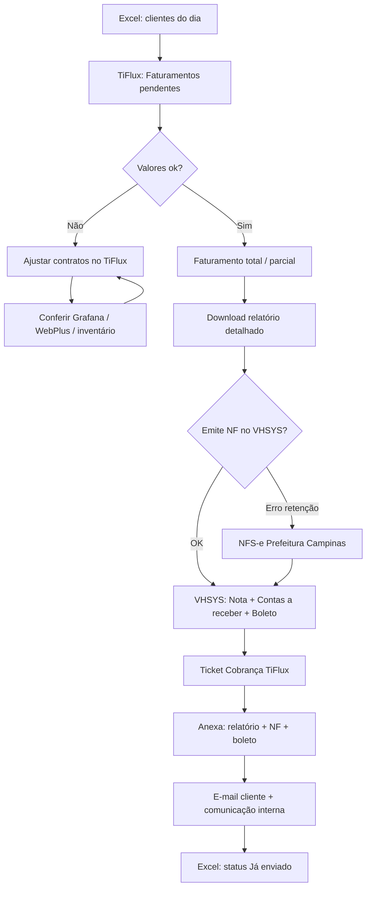

# Automação do Faturamento Mensal AVS — Análise da Demo

> **Proveniência:** cópia versionada de `NFE/ANALISE_PROJETO_AUTOMACAO.md` (2026-07-20). SoT no repo: `docs/hub/`.

**Fonte:** Reunião Teams 08/06/2026 (~35 min)  
**Participantes:** Jean Nascimento, Alinne Freitas (demo), Susana Veiga  
**Objetivo acordado:** automatizar o fluxo de cobrança mensal via integração de software (fase 1: TiFlux ↔ VHSYS)

---

## 1. Problema atual

O faturamento mensal é **manual, multi-sistema e repetitivo**. Para cada cliente do dia, a operação:

1. Consulta planilha Excel + TiFlux + Grafana/WebPlus  
2. Ajusta quantidades em contratos  
3. Emite faturamento / relatório  
4. Emite NFS-e (prefeitura ou VHSYS)  
5. Lança contas a receber / boleto no VHSYS  
6. Anexa relatório + NF + boleto no ticket de cobrança no TiFlux e envia ao cliente  

Dor principal citada: retrabalho entre **TiFlux** e **VHSYS**, e risco de divergência de quantidades (máquinas, licenças, VMs).

---

## 2. Sistemas envolvidos

| Sistema | Papel no processo |
|---------|-------------------|
| **Excel SharePoint** (`Faturamento mensal 2026.xlsx`) | Controle operacional do mês: clientes, divisão, valor, status (`Pendente` / `Pronto para enviar` / `Já enviado`), reajuste, observações com regras de negócio |
| **TiFlux** (`app.tiflux.com`) | Contratos, faturamentos pendentes, tickets de cobrança, relatório detalhado, comunicação com cliente |
| **VHSYS** (`app.vhsys.com.br`) | NFS-e (quando possível), serviços, financeiro → contas a receber, boleto |
| **NFS-e Prefeitura Campinas** | Emissão de NF quando VHSYS falha (ex.: retenção de impostos) |
| **Grafana** (`grafana.avstecnologia.cloud` — Dashboard Inventário N8N) | Fonte de verdade de inventário (PCs, hosts, VMs, licenças M365) |
| **WebPlus / Acronis / M365** | Conferência de backup, seats e consumo |
| **n8n** | Já usado para popular inventário no Grafana |

---

## 3. Fluxo atual (as-is)



### 3.1 Caso simples (ex.: Paula Moreira — Unifi)

1. Excel → filtrar cliente do dia  
2. TiFlux → Relatórios → Faturamentos pendentes  
3. Data base **à frente** (senão não lista) + cliente + contratos + valores avulsos  
4. Conferir valor → **Faturamento total** → Faturar  
5. Download relatório detalhado  
6. VHSYS → Serviços → Notas Fiscais → Adicionar  
   - Cliente, descrição “mensalidade”, valor, suporte técnico, 1 parcela  
   - Vencimento do relatório, forma de pagamento (boleto / às vezes Pix)  
7. Lançar recebimento (Primeiro Damp / contas a receber) e baixar boleto  
8. Excel → status **Pronto para enviar**  
9. Ticket TiFlux → mensagem + anexos (relatório, NF, boleto) → enviar → fechar  
10. Comunicação interna: “cobrança enviada”  

### 3.2 Caso complexo (ex.: Afiadora)

Além do fluxo acima:

- Conferir inventário no **Grafana** (ex.: 63 PCs vs contrato desatualizado)  
- Ajustar itens de contrato (gestão, antivírus, backup, suporte, VOIP, hosting, M365…)  
- Cancelar contrato duplicado/errado (ação **Cancelar contrato**, data “ontem” para preservar histórico)  
- Gerar **adendo** quando quantidade muda  
- Incluir tickets avulsos (ex.: #60258, #60265 — preparar notebook)  
- Em clientes com retenção: emitir NF na **prefeitura**; no VHSYS só lançar contas a receber com valor **líquido** (não o do relatório cheio)  
- Botão TiFlux de integração financeira (criar venda / espelho no ERP) quando aplicável  

### 3.3 Por que existe o Excel

Alterações de contrato (ex.: +1 máquina) **não devem ir direto ao TiFlux** no dia, senão entram na próxima fatura cedo demais. O Excel acumula mudanças do mês para aplicar **de uma vez** na virada do faturamento. Também guarda regras em texto livre (consumo acima de R$ 100, cobrança anual, IPCA, descontos, etc.).

---

## 4. Decisão da reunião (escopo do projeto)

### Fase 1 (prioridade — acordada)

**Integrar TiFlux → VHSYS** para eliminar o lançamento manual da emissão financeira.

- Entrada: faturamento/relatório do TiFlux  
- Saída: nota/serviço + contas a receber + boleto no VHSYS (quando regras permitirem)  
- Envio ao cliente (ticket TiFlux) pode ser semi-automático (template de e-mail + anexos)  
- Excel permanece como está nesta fase  

Jean: *“Vou tentar pegar primeiro a parte do TiFlux e do VHSYS… já está configurado.”*

### Fase 2 (depois)

- Reformular planilha Excel (ou substituir por base estruturada)  
- Usar Grafana como fonte de verdade de quantidades  
- Alertas: “mudou quantidade de VM / PC / licença → atualizar contrato”  
- Padronizar nomes cliente/contrato entre Excel, TiFlux e VHSYS  

---

## 5. Regras de negócio capturadas

| Regra | Detalhe |
|-------|---------|
| Data base nos faturamentos pendentes | Usar data **futura**, senão o TiFlux não lista |
| Sempre incluir | Contratos **e** valores avulsos (tickets) |
| Valor zerado | Usar faturamento **parcial** e selecionar só linhas com valor |
| Pagamento padrão | Boleto; Pix sob pedido do cliente |
| Retenção ISS | VHSYS pode falhar → emitir na prefeitura Campinas; valor no contas a receber = líquido |
| Cancelamento de contrato | Sempre **Cancelar** (não excluir); data no passado recente |
| Faturamento automático no TiFlux | Hoje desligado na maioria dos contratos (controle humano) |
| Adendo | Quantidade/valor muda → gerar adendo antes de faturar |
| Ticket de cobrança | Mensal recorrente; anexar **3 arquivos**: relatório, NF, boleto; comunicação interna obrigatória |
| Observações Excel | Consumo excedente, anualidade, IPCA, descontos, mês específico de cobrança |

---

## 6. Projeto de software — proposta técnica

### 6.1 Nome sugerido

`avs-billing-automation` — Automação de faturamento mensal AVS

### 6.2 Objetivo da Fase 1

Dado um cliente + data de referência, o sistema:

1. Lê faturamentos pendentes / relatório no **TiFlux** (API preferencial; fallback RPA)  
2. Monta payload financeiro  
3. Cria documento de serviço / espelho no **VHSYS**  
4. Cria contas a receber + gera boleto  
5. Baixa PDFs (relatório, NF, boleto)  
6. Anexa no ticket de cobrança TiFlux e envia (ou deixa em rascunho para revisão humana)  
7. Registra log de auditoria e status  

### 6.3 Arquitetura sugerida

```
[Scheduler / Trigger manual]
        │
        ▼
┌───────────────────┐     API      ┌─────────────┐
│  Orquestrador     │─────────────▶│   TiFlux    │
│  (n8n ou serviço) │◀─────────────│             │
└─────────┬─────────┘              └─────────────┘
          │ API / integração
          ▼
┌───────────────────┐              ┌─────────────────────┐
│      VHSYS        │─────────────▶│ NFS-e Prefeitura    │
│ (serviço+financeiro)│  (manual/   │ (exceção retenção)  │
└───────────────────┘   semi-auto) └─────────────────────┘
          │
          ▼
   Storage anexos + log (SharePoint / S3 / DB)
```

**Recomendação:** reutilizar **n8n** (já na stack Grafana/inventário) + worker Node/Python para regras e anexos. Preferir API oficial TiFlux/VHSYS; RPA só onde não houver endpoint.

### 6.4 Entregáveis Fase 1

1. Mapeamento de APIs TiFlux (contratos, billings, tickets, anexos) e VHSYS (NF, contas a receber, boleto)  
2. Workflow: `cliente + data → faturar → emitir → anexar → notificar`  
3. Fila de revisão humana (especialmente retenção / Pix / valores divergentes)  
4. Template de e-mail de cobrança no TiFlux  
5. Dashboard simples: processados / falhas / pendentes de aprovação  
6. Runbook operacional  

### 6.5 Fora de escopo (Fase 1)

- Substituir o Excel  
- Automatizar 100% da NFS-e prefeitura (tratar como exceção assistida)  
- Alertas Grafana → contrato (Fase 2)  

### 6.6 Riscos

| Risco | Mitigação |
|-------|-----------|
| VHSYS não retém ISS corretamente | Branch “retenção” → fluxo prefeitura + lançamento líquido |
| Nomes divergentes Excel/TiFlux/VHSYS | Cadastro canônico + aliases |
| API limitada / sem webhook | Polling + RPA pontual |
| Alterar contrato cedo demais | Manter Excel como buffer até Fase 2 |
| Valores avulsos omitidos | Validação: contratos + tickets obrigatórios |

---

## 7. Backlog inicial (sugestão)

### Epic A — Integração TiFlux → VHSYS
- [ ] A1. Auth e clients API TiFlux / VHSYS  
- [ ] A2. Listar faturamentos pendentes por cliente/data  
- [ ] A3. Download relatório detalhado  
- [ ] A4. Criar NF/serviço no VHSYS a partir do relatório  
- [ ] A5. Criar contas a receber + boleto  
- [ ] A6. Download NF + boleto  
- [ ] A7. Anexar no ticket Cobrança + enviar template  
- [ ] A8. Modo dry-run + aprovação humana  

### Epic B — Exceções
- [ ] B1. Detecção de retenção / falha VHSYS NF  
- [ ] B2. Checklist assistido prefeitura Campinas  
- [ ] B3. Pix vs boleto por cliente  

### Epic C — Fase 2 (depois)
- [ ] C1. Nova base/planilha estruturada  
- [ ] C2. Sync quantidades Grafana → contrato  
- [ ] C3. Alertas de divergência inventário × contrato  

---

## 8. Critérios de sucesso (Fase 1)

- Reduzir para **poucos cliques / aprovação** o caminho TiFlux → VHSYS → ticket  
- Zero retrabalho de digitação de valor/vencimento/cliente no caminho feliz  
- Log auditável por cliente/mês  
- Casos com retenção claramente sinalizados (não silenciosos)  

---

## 9. Artefatos gerados desta análise

Mídia bruta **permanece em NFE/** (fora do git do Management — volume/áudio):

| Arquivo | Descrição | Onde |
|---------|-----------|------|
| `transcricao.txt` / `transcricao.srt` | Transcrição Whisper (PT) | `NFE/` (não copiado) |
| `frames/` | Screenshots a cada ~45s | `NFE/` (não copiado) |
| `frames_extra/` | Frames em timestamps-chave | `NFE/` (não copiado) |
| `reuniao_audio.wav` | Áudio 16 kHz da reunião | `NFE/` (não copiado) |

Spec de negócio + sketch de faturamento: `docs/hub/ANALISE_PROJETO_AUTOMACAO.md`, `docs/hub/sketch-fluxo-faturamento.html`.

---

## 10. Próximo passo recomendado

Implementar **Epic A** começando por:

1. Inventário de endpoints/tokens TiFlux e VHSYS já existentes na AVS  
2. Protótipo n8n: 1 cliente simples (ex. Paula) end-to-end em dry-run  
3. Depois generalizar para clientes com múltiplos contratos (ex. Afiadora)
