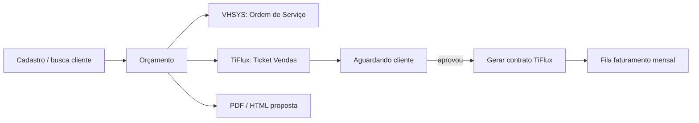
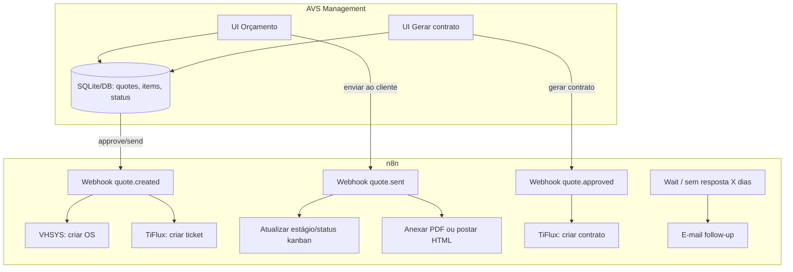

# Módulo Orçamento → Ticket → Contrato (AVS Management)

> **Proveniência:** cópia versionada de `NFE/MODULO_ORCAMENTO_CONTRATO.md` (2026-07-20). SoT no repo: `docs/hub/`.

**Fonte:** Reunião 14/07/2026 — AVS Management  
**Arquitetura:** Management = UI + fonte de verdade · n8n = orquestração · TiFlux/VHSYS = destino  
**Relacionado:** faturamento mensal (`ANALISE_PROJETO_AUTOMACAO.md`, checklist, sketch) — todos em `docs/hub/`

---

## 1. Visão geral

Dois fluxos comerciais no mesmo hub (Management), separados do faturamento recorrente, mas reutilizando cadastro de cliente e integrações:

| Fluxo | Objetivo |
|-------|----------|
| **A — Orçamento** | Gerar proposta (implantação + mensalidade), OS no VHSYS, ticket no TiFlux |
| **B — Contrato** | Cliente aprovou → gerar contrato TiFlux a partir do orçamento |
| **C — Faturamento** (outro módulo) | Cobrança mensal recorrente pós-contrato |



---

## 2. Fluxo A — Orçamento (passo a passo)

### 2.1 Entrada
- Em **Cadastro** (ou menu dedicado): botão **Gerar orçamento**
- Pesquisa dinâmica de cliente por **CNPJ** ou **nome** (já há base no Management)
- Se cliente **não existir**: modal de cadastro rápido **por cima** da tela atual, **sem perder** dados do orçamento (overlay / drawer)

### 2.2 Estrutura da tela de orçamento

#### Passo 2 — Módulos (blocos iguais)

**Jornada UX travada (3 verbos)**

| Verbo | Onde | O quê |
|-------|------|--------|
| **Inserir bloco** | Topo do passo 2 (primary) | Abre picker: Biblioteca · em branco · restaurar Implantação/Mensalidade (se ausentes) |
| **Biblioteca** | Topo (secondary) + dialog CRUD | Catálogo `quote_module_templates` — **Biblioteca de blocos** |
| **Salvar na biblioteca** | Menu ⋯ do card do bloco | Persiste título + `show_labor` + linhas → `quote_module_templates` (`name` = `title` = valor digitado) |

Proibido na UI do wizard: strings “modelo de itens”, “modelo de módulo”, ids `custom_*` expostos, dualidade apply/save de itens.

**Seed automático ≠ bloco fixo**

- Em **todo orçamento novo**, o sistema **sempre seeda** dois módulos:
  - `id=implantacao`, título `Implantação`, `legacy_kind=implantacao`, `show_labor=false`
  - `id=mensalidade`, título `Mensalidade`, `legacy_kind=mensalidade`, `show_labor=true`
- Eles **não são fixos**: o usuário trata **todos** os módulos como blocos iguais:
  - **Remover** (confirmação; apaga itens daquele `module.id`)
  - **Reordenar** (MVP: botões ↑↓; PDF segue `sort_order` do canvas)
  - **Renomear** título (ex. Implantação → outro nome; `id`/`legacy_kind` permanecem para espelho/PDF OS enquanto o módulo existir)
- Pode remover **um ou os dois**; lista pode ficar vazia em draft; PDF/resumo só listam o que restar.
- **Inserir bloco** (picker):
  1. Entrada da **Biblioteca de blocos** (`quote_module_templates`) — importa título + `show_labor` + linhas; `id = custom_<uuid>` (interno; **não** expor na UI); `legacy_kind=null`
  2. **Bloco em branco** — título livre; `id` slug único; `show_labor=false` no MVP
  3. Se Implantação/Mensalidade foram removidos → **restaurar** presets sistema (mesmo `id`/`legacy_kind`) — **não** vêm da Biblioteca
- Card do bloco: título editável · ↑↓ · **+ Item** · remover; **⋯** só **Salvar na biblioteca**
- Dialog **Biblioteca de blocos**: CRUD de `quote_module_templates` (nome do bloco + linhas VHSYS + defaults de **Faturado por** e **Observações**). Dialogs/listas: `max-h` dinâmico + `overflow-y-auto` (conteúdo nunca fica inacessível).

**Por bloco (genérico)**

- Itens em lista (N linhas) com `section = module.id`
  - Descrição via **busca VHSYS** + via dupla cadastrar no VHSYS
  - Quantidade, valor unitário / total
  - Adicionar / remover linhas
- **`quote_templates` (modelos de itens) = legado** — API/tabela permanecem; **não montar** painel/apply/save de itens no wizard neste MVP
- Forma de pagamento + desconto %↔R$ espelho (`líquido = subtotal − desconto`)
- Mão de obra só se `show_labor` (default Mensalidade; herdado do bloco da Biblioteca se houver)
- Campo **Faturado por** **por bloco** (busca VHSYS); **sem** Faturado por geral no wizard. Defaults da Biblioteca copiam para o módulo ao inserir e continuam editáveis no orçamento.

#### PDF do orçamento
- Spec detalhada: [`SPEC_PDF_ORCAMENTO.md`](./SPEC_PDF_ORCAMENTO.md)
- Título: `Orçamento : M{id}` (nunca “Ordem de serviço”)
- N bandas na ordem `sort_order`; título = `module.title`
- Resumo por módulo presente + total geral; rótulos OS VHSYS só se `legacy_kind` implantacao/mensalidade ainda existirem
- Campos de **assinaturas** (data do aceite / prestador / sacado)

#### Passo 3 — Ações / Revisão
1. **Salvar orçamento** (só Management)
2. **Revisão antes de enviar:** mostra **e-mail principal** do cliente (editável) + destinatários extras (CC); preview dos módulos na ordem atual
3. **Salvar e criar ticket no TiFlux** / Enviar (outbox `quote.submit` inclui `recipients`)
4. (Implícito na reunião) espelhar **OS no VHSYS** ao avançar

### 2.3 VHSYS — Ordem de serviço
Ao gerar/avançar orçamento:
1. Nova **ordem de serviço**
2. Selecionar **cliente** (já resolvido)
3. **Técnico** — preencher automaticamente (usuário logado / regra AVS); editável
4. **Produto(s)** — dropdown; permitir **vários itens** (lista)

### 2.4 TiFlux — Ticket de orçamento
Ao “Salvar e adicionar ticket”:

| Campo | Regra |
|-------|--------|
| Solicitante | Opção de **solicitante customizado** (como no TiFlux) |
| Cliente | Puxar pelo CNPJ automaticamente |
| Responsável | Nome do **técnico/usuário logado** no Management; **alterável** |
| Mesa | **Vendas** ou **Comercial** |
| Informações financeiras | Campo personalizado — validar se a API/preenchimento puxa corretamente |
| Prioridade | Dropdown; default **Baixa** |
| Status | Default **Pendente**; modificável |
| Estágio (kanban) | Deve mudar **junto com o status** ao enviar ao cliente |
| Anexo / corpo | PDF do orçamento **ou** HTML/texto customizado como resposta/comentário |

**Pós-envio ao cliente**
- Verificar se dá para alterar o **kanban dinamicamente** quando “enviado ao cliente”
- **Fallbacks / gatilhos:** sem resposta por X tempo → e-mail (n8n cron/wait)

### 2.5 Leads / temperatura
- Campo personalizado de **temperatura** do lead (`quente` / `morno` / `frio`)
- Filtro de leads por temperatura na listagem do Management (e/ou TiFlux)

#### Lista de orçamentos — painel de pipeline (UI)
Na **página 1** (lista de orçamentos), entre header/filtros e a listagem:

1. **Três cards circulares** em linha, ordem **Quente → Morno → Frio** (ícones Flame / Thermometer / Snowflake). Contagem + **soma R$** (`items[].total_value`) dos orçamentos **abertos** (`status ∈ {draft, submitted, sent}`) por `lead_temperature`. Sem círculo “Sem lead”.
2. Strip **“Quase fechados”**: leads `quente` ainda abertos (cap **5**, `updated_at` desc); clique abre o orçamento (`/orcamentos/:id`). Se zero → “Nenhum lead quente pendente”.
3. Clique no card → aplica filtro de lead; **segundo clique no mesmo card desseleciona** (`all`); estado ativo com ring na cor do card.
4. Dados: FE agrega via `listQuotes({ limit: 100 })` **sem** filtros de status/lead (query própria `quotes/pipeline-summary`). **Sem** endpoint `/orcamentos/stats`. Painel permanece visível mesmo com lista vazia por filtro.

---

## 3. Fluxo B — Cliente aprovou → Contrato

1. Orçamento já existe no Management (status `aprovado`)
2. Botão **Gerar contrato**
3. Prefill a partir do orçamento:
   - Cliente, itens de mensalidade (e o que couber de implantação, se for para contrato)
   - Nomes, quantidades, valores
4. Tela de revisão: **remover / adicionar** partes (customizável)
5. Push para **Contratos no TiFlux** (`POST`/`PUT` conforme API — hoje Management só tem leitura parcial; criar contrato será extensão do `TifluxClient`)
6. Contrato ativo alimenta depois o módulo de **faturamento mensal**

---

## 4. Arquitetura Management + n8n



| Evento Management | n8n faz |
|-------------------|---------|
| `quote.saved` | Só persiste (sem n8n) ou sync leve |
| `quote.submit_os_ticket` | Cria OS VHSYS + ticket TiFlux |
| `quote.sent_to_client` | Anexo PDF/HTML + muda estágio/status |
| `quote.no_reply` | Timer → e-mail |
| `quote.approved` → `contract.generate` | Cria contrato TiFlux com itens |
| Callback | Atualiza IDs externos e status no Management |

**Fonte de verdade do orçamento:** sempre o Management.  
TiFlux ticket/contrato e VHSYS OS são **projeções**.

---

## 5. Modelo de dados (Management)

### `quotes` (orçamentos)
- id, client_id (local), tiflux_client_id, vhsys_client_id  
- cnpj, status (`draft` / `submitted` / `sent` / `approved` / `rejected` / `contracted`)  
- lead_temperature  
- billed_by_type (`distribuidor` / `fornecedor`), billed_by_name  
- **`modules_json`** — array ordenado de módulos (SoT do passo 2 / PDF):

```json
[{
  "id": "implantacao",
  "title": "Implantação",
  "legacy_kind": "implantacao",
  "show_labor": false,
  "payment_plan": null,
  "discount_pct": null,
  "discount_value": null,
  "labor_hours": null,
  "labor_hourly_rate": null,
  "sort_order": 0
}]
```

- Colunas flat `implant_*` / `monthly_*` = **espelho legado** (n8n / listagens):
  - Save: se módulo com `legacy_kind` existir → espelhar pagamento/desconto/labor; se removido → zerar essas colunas
  - Load sem `modules_json` → sintetizar seed Implantação+Mensalidade a partir das colunas flat
- tiflux_ticket_number, vhsys_os_id, pdf_path, notes, client_email, extra_recipients  
- created_by, created_at, sent_at, approved_at  

**Validação:** ids de módulo únicos; títulos não vazios; itens só de módulos existentes; lista pode ficar vazia após remover tudo (draft).

### `quote_items`
- quote_id, section (= `module.id`, texto livre — **sem** CHECK binário)  
- template_key (opcional)  
- name, qty, unit_value, total_value  
- sort_order  

### `quote_templates` (legado — fora da UI do wizard)
- key, name, section (= `module.id`, texto livre), lines_json
- Modelos de **itens** dentro de um módulo já existente (não criam módulo)
- **MVP UX:** API/tabela mantidas; **não expor** no wizard (sem `QuoteTemplatesPanel` / apply / save-as de itens). Sem migração DB neste MVP.

### `quote_module_templates` — Biblioteca de blocos
Catálogo reutilizável de **blocos** custom (ex. Licenças). Na UI: **Biblioteca** / **Salvar na biblioteca**. Implantação/Mensalidade **não** precisam de seed aqui — restore de sistema permanece no wizard.

| Coluna | Tipo | Notas |
|--------|------|-------|
| `id` | INTEGER PK | |
| `key` | TEXT NOT NULL UNIQUE | slug estável |
| `name` | TEXT NOT NULL | nome no catálogo (picker / CRUD) |
| `title` | TEXT NOT NULL | título default do módulo ao importar |
| `show_labor` | INTEGER NOT NULL DEFAULT 0 | 0/1 |
| `notes` | TEXT NULL | observação default ao importar (editável no orçamento) |
| `billed_by_name` | TEXT NULL | faturado por default ao importar (editável no orçamento) |
| `lines_json` | TEXT NOT NULL | `[{name, qty, unit_value, sort_order}]` (pode ser `[]`) |
| `created_at` | TEXT NOT NULL | ISO |

**API** (perm `orcamentos`):
- `GET /orcamentos/module-templates`
- `POST /orcamentos/module-templates`
- `PATCH /orcamentos/module-templates/{id}`
- `DELETE /orcamentos/module-templates/{id}`

**Import no wizard (Inserir bloco ← Biblioteca):** ao selecionar → append módulo `custom_<uuid>` + itens com `section = module.id` a partir de `lines_json`; título resolvido = `title` (com `name` alinhado no save); `notes` e `billed_by_name` do template viram defaults do módulo (editáveis depois). Autosave do draft persiste `modules_json` + `quote_items`. `custom_*` é interno — não exibir na UI.

### `contracts_from_quotes` (opcional)
- quote_id, tiflux_contract_ids[], snapshot JSON

---

## 6. Telas UI (Management)

1. **Cadastro** — botão “Gerar orçamento”  
2. **Orçamento** — passo 2: **Inserir bloco** · **Biblioteca** · **Salvar na biblioteca**; seed Implantação+Mensalidade; picker Biblioteca/em branco/restore; add/remove/rename/↑↓; **sem** UI de modelos de itens; pagamento, faturado por, salvar  
3. **Modal cliente** — CNPJ/nome; cadastro rápido overlay  
4. **Lista de orçamentos / leads** — filtro por temperatura e status; painel pipeline (3 círculos Quente/Morno/Frio + soma R$ + strip “Quase fechados”) — ver §2.5  

5. **Detalhe orçamento** — enviar ticket, ver PDF, marcar enviado, aprovar, gerar contrato  
6. **Gerar contrato** — editor de itens pré-preenchidos → confirmar push TiFlux  

Permissões RBAC sugeridas: `orcamentos`, `aprovar_orcamento`, `gerar_contrato` (além das atuais de cadastro).

---

## 7. Relação com o módulo de Faturamento

| Momento | Módulo |
|---------|--------|
| Antes do contrato | Orçamento + ticket comercial |
| Contrato ativo no TiFlux | Itens de **mensalidade** viram base da fila de faturamento |
| Todo mês | Módulo Faturamento (Management + n8n → VHSYS + ticket cobrança) |

Orçamento **não** emite boleto mensal; só define o que depois será cobrado.

---

## 8. Fases de entrega sugeridas

### Fase O1 — Orçamento no Management (sem TiFlux ticket ainda)
- Tela + templates + itens implantação/mensalidade  
- Busca/cadastro cliente overlay  
- Salvar PDF  
- Persistência local  

### Fase O2 — Integrações de saída
- n8n: OS VHSYS + ticket TiFlux (mesa Comercial/Vendas)  
- Anexo PDF / comentário HTML  
- Status + estágio  

### Fase O3 — Follow-up e aprovação
- Gatilho sem resposta  
- Botão aprovado → Gerar contrato TiFlux  
- Temperatura de lead + filtros  

### Fase O4 — Ligação com Faturamento
- Contrato gerado entra na fila mensal / sync de itens  

---

## 9. Pontos a validar na API / produto TiFlux

- [ ] `POST /tickets` com solicitante customizado, mesa, prioridade, status, campos personalizados (financeiro, temperatura)
- [ ] Upload de arquivo no ticket + resposta HTML
- [ ] Alterar estágio/kanban via API quando “enviado ao cliente”
- [ ] Criar **contrato** com itens via API (hoje Management só lista/`PUT` parcial)
- [ ] Campo personalizado “informações financeiras” — ID da entity e se aceita write
- [ ] VHSYS: endpoint de **ordem de serviço** + múltiplos itens (não está no client atual)

---

## 10. Checklist rápido das notas da reunião

- [x] Botão gerar orçamento no cadastro  
- [x] TiFlux orçamento/ticket + VHSYS OS  
- [x] Técnico auto + produtos lista múltipla  
- [x] Modelos pré-preenchidos  
- [x] Seção “Implantação” (não “serviços” genérico)  
- [x] Pagamento implantação + desconto %/valor + parcelado 1x–12x + recorrente anual
- [x] Seção “Mensalidade” recorrente
- [x] Add/remove campos
- [x] Busca CNPJ/nome + modal cadastro sem perder dados
- [x] Faturado por **por bloco** (busca VHSYS); sem Faturado por geral no wizard; defaults na Biblioteca
- [x] Observações globais (passo 3) + Observações por bloco (opcional)
- [x] Descrição de item via catálogo VHSYS (`/produtos`)
- [x] Via dupla: cadastrar no VHSYS item digitado inexistente (`POST /produtos`)  
- [x] Salvar orçamento  
- [x] Salvar + ticket TiFlux  
- [x] Solicitante customizado, cliente CNPJ, responsável logado, mesa Vendas/Comercial  
- [x] Financeiro personalizado, prioridade baixa, status pendente  
- [x] Kanban/estágio dinâmico ao enviar  
- [x] PDF ou HTML no ticket  
- [x] Fallback sem resposta → e-mail  
- [x] Aprovado → gerar contrato TiFlux customizável  
- [x] Leads temperatura + filtro  

---

## 11. Próximo passo recomendado

1. Wireframe das 2 telas (Orçamento + Gerar contrato) no padrão visual do Management  
2. Confirmar com TiFlux/VHSYS os endpoints de ticket, OS e create contract  
3. Implementar **O1** no `avs-management` (UI + DB) antes de n8n  

Documento irmão: faturamento mensal usa o **mesmo hub**; orçamento é o “antes” do contrato recorrente.
